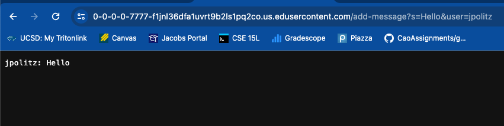
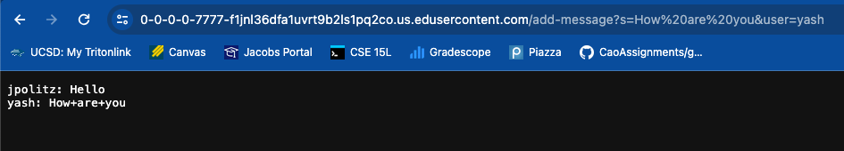

# Lab Report 2

## Part 1 - Chat Server
```java
import java.io.IOException;
import java.net.URI;
import java.util.ArrayList;

class Handler implements URLHandler {
    String messageInput = "";
    String userInput = "";
    String output = "";

    public String handleRequest(URI url) {
        if (url.getPath().equals("/")) {
            return output;
        }
        else {
            if (url.getPath().contains("/add-message")) {
                String[] parameters = url.getQuery().split("&");
                String[] message = parameters[0].split("=");
                String[] user =  parameters[1].split("=");

                if (message[0].equals("s")) {
                    messageInput = message[1];
                }
                if (user[0].equals("user")){
                    userInput = user[1];
                }
                
                output += String.format(userInput + ": " + messageInput + "\n");
                return output;
            } 
        }
        return "404 Not Found!";
    }
}

class ChatServer {
    public static void main(String[] args) throws IOException {
        if(args.length == 0){
            System.out.println("Missing port number! Try any number between 1024 to 49151");
            return;
        }

        int port = Integer.parseInt(args[0]);

        Server.start(port, new Handler());
    }
}
```


* The methods called from my code is the `handleRequest` method, which records and returns the relevant information from the query formatted correctly. 
  The relevent information includes the user's name `jpolitz` and message `Hello` found by splitting the query.
* The relevent arguments to this method is the url passed into the `handleRequest` method. The path of this url contains `/add-message`, so the method uses the `getQuery()`,
  `split()`, and `equals()` functions to separate the query into the user's name and message to be printed in the correct format. The values of relevant fields of the class
  are the `userInput` and `messageInput`'s values of `jpolitz` and `Hello`, used to return the `output`.
* From this specific request, the values of relevant fields of the class change according to the url path. The URI input changed to the url of the webpage.
  In this request, the field `messageInput` changed to `Hello` after `s=` in the query, `userInput` changed to `jpolitz` after `user=` in the query,
  and `output` added the formatted string of user and message to display on the webserver.


* The methods called from my code is the `handleRequest` method, which returns the relevant information from the query formatted correctly. 
  The relevent information includes the user's name `yash` and message `How are you` found by splitting the query.
* The relevent arguments to this method is the url passed into the `handleRequest` method. The path of this url contains `/add-message`, so the method uses the `getQuery()`,
  `split()`, and `equals()` functions to separate the query into the user's name and message to be printed in the correct format. The values of relevant fields of the class
  are the `userInput` and `messageInput`'s values of `yash` and `How are you`, used to return the `output`.
* From this specific request, the values of relevant fields of the class change according to the url path. The URI input changed to the new url of the webpage.
  In this request, the field `messageInput` changed to `How are you` from after `s=` in the query, `userInput` changed to `yash` from after `user=` in the query,
  and `output` changed to add the formatted string of the new user and message to display on the webserver.

## Part 2


## Part 3


