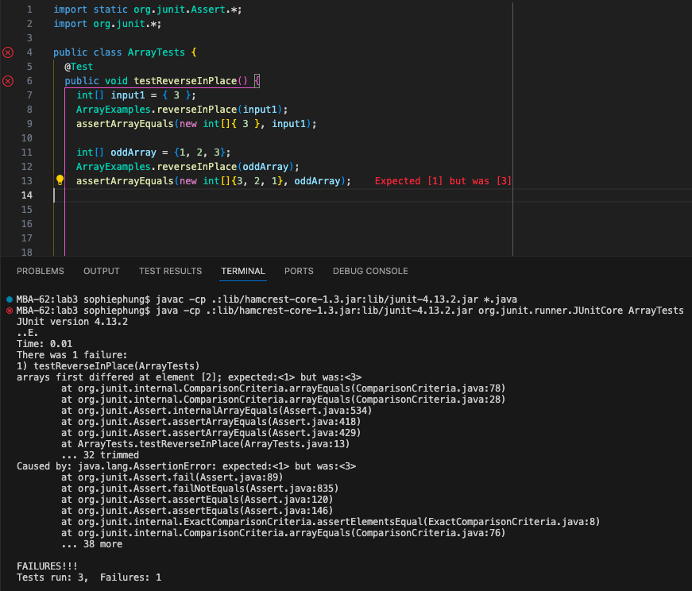

# Lab Report 3

## Part 1 - Bugs
I chose the first bug in the reverseInPlace() method in the ArrayExamples.java file from Week 4's lab.

### Failure Inducing Input for the buggy program
```java
@Test
public void testReverseInPlace() {
  int[] oddArray = {1, 2, 3};
  ArrayExamples.reverseInPlace(oddArray);
  assertArrayEquals(new int[]{3, 2, 1}, oddArray);
}
```

### Input that doesn't induce a failure
```java
@Test 
public void testReverseInPlace() {
  int[] input1 = { 3 };
  ArrayExamples.reverseInPlace(input1);
  assertArrayEquals(new int[]{ 3 }, input1);
}
``` 

### The Symptom


### The Bug
**Before**
```java
static void reverseInPlace(int[] arr) {
  for(int i = 0; i < arr.length; i += 1) {
    arr[i] = arr[arr.length - i - 1];
  }
}
```
**After**
```java
static void reverseInPlace(int[] arr) {
  for(int i = 0; i < arr.length/2; i += 1) {
    int temp = arr[i];
    arr[i] = arr[arr.length - i - 1];
    arr[arr.length - i - 1] = temp;
  }
}
```

### Why the fix addresses the issue
In the buggy code, there are issues because the original code loops through the entire array and changes each iteration of the index value to the value from the 
opposite side of the array. Instead of switching the corresponding opposite values in the array, the original implementation doesn't stop at the middle and continues, 
overwriting the reversed elements. The fix addresses the issue by making sure the for loop stops at the middle of the array, to avoid overwriting the previous reversals. It 
also makes sure to change the elements at the end of the array to ensure a true reversal as well. With each index accessed by the for loop, the new implementation changes that 
index to the mirrored one, and the mirrored one to the accesssed index. 


## Part 2 - Researching Commands (find command)
### -type command 
**Example 1**
```console
MBA-62:docsearch sophiephung$ find . -type d
.
./lib
./.git
./.git/objects
./.git/objects/0c
./.git/objects/b2
./.git/objects/a5
./.git/objects/bc
./.git/objects/ab
./.git/objects/27
./.git/objects/pack
./.git/objects/11
./.git/objects/75
./.git/objects/2f
./.git/objects/9a
./.git/objects/info
./.git/objects/6d
./.git/objects/0f
./.git/objects/e6
./.git/objects/71
./.git/info
./.git/logs
./.git/logs/refs
./.git/logs/refs/heads
./.git/logs/refs/remotes
./.git/logs/refs/remotes/origin
./.git/logs/refs/remotes/upstream
./.git/hooks
./.git/refs
./.git/refs/heads
./.git/refs/tags
./.git/refs/remotes
./.git/refs/remotes/origin
./.git/refs/remotes/upstream
./.git/branches
./technical
./technical/government
./technical/government/About_LSC
./technical/government/Env_Prot_Agen
./technical/government/Alcohol_Problems
./technical/government/Gen_Account_Office
./technical/government/Post_Rate_Comm
./technical/government/Media
./technical/plos
./technical/biomed
./technical/911report
```
This find command option of `-type` tries to find a file of type `d`, which is a *directory* type as described in the manual found through `man find`. This is useful for finding 
a list of files that are of a directory type, if you wanted to find the name of a lower directory to change into. I found this at 
https://www.geeksforgeeks.org/find-command-in-linux-with-examples/ and searched the official documentation in the built-in `man` command in the terminal.

**Example 2**
```console
MBA-62:docsearch sophiephung$ find ./technical/911report -type f
./technical/911report/chapter-13.4.txt
./technical/911report/chapter-13.5.txt
./technical/911report/chapter-13.1.txt
./technical/911report/chapter-13.2.txt
./technical/911report/chapter-13.3.txt
./technical/911report/chapter-3.txt
./technical/911report/chapter-2.txt
./technical/911report/chapter-1.txt
./technical/911report/chapter-5.txt
./technical/911report/chapter-6.txt
./technical/911report/chapter-7.txt
./technical/911report/chapter-9.txt
./technical/911report/chapter-8.txt
./technical/911report/preface.txt
./technical/911report/chapter-12.txt
./technical/911report/chapter-10.txt
./technical/911report/chapter-11.txt
```
This command tries to find a file of type `f`, which is a regular file type. This is useful for if you want to find all the file paths in a directory, without including inner 
directories. I found this at https://www.geeksforgeeks.org/find-command-in-linux-with-examples/ and searched the official documentation in the built-in `man` command in the 
terminal.


### -iname command 
**Example 1**
```console
MBA-62:docsearch sophiephung$ find ./technical/911report/ -iname "*.TXT"
./technical/911report//chapter-13.4.txt
./technical/911report//chapter-13.5.txt
./technical/911report//chapter-13.1.txt
./technical/911report//chapter-13.2.txt
./technical/911report//chapter-13.3.txt
./technical/911report//chapter-3.txt
./technical/911report//chapter-2.txt
./technical/911report//chapter-1.txt
./technical/911report//chapter-5.txt
./technical/911report//chapter-6.txt
./technical/911report//chapter-7.txt
./technical/911report//chapter-9.txt
./technical/911report//chapter-8.txt
./technical/911report//preface.txt
./technical/911report//chapter-12.txt
./technical/911report//chapter-10.txt
./technical/911report//chapter-11.txt
```
`-iname` searches for files with the specified pattern regardless of the case of characters. This is useful for when you want to include certain file names in your search that 
may be capitalized or may not. Playing around with the command, it was interesting to see that the pattern searched could be found even with unconventional capitalization through 
the `-iname` option. I found this at https://www.geeksforgeeks.org/find-command-in-linux-with-examples/ and searched the official documentation in the built-in `man` command in 
the terminal.

**Example 2**
```console
MBA-62:docsearch sophiephung$ find . -iname Chapter-1.txt
./technical/911report/chapter-1.txt
```
This is a case-sensitive version of -name, which will search for files that have the specified name, but does not care about case of characters. This is useful for
finding certain files when you know the name but don't remember the capitalization of the words. I found this at https://www.geeksforgeeks.org/find-command-in-linux-with-examples/ 
and searched the official documentation in the built-in `man` command in the terminal. 


### -mindepth command 
**Example 1**
```console
MBA-62:docsearch sophiephung$ find . -mindepth 5
./.git/logs/refs/heads/main
./.git/logs/refs/remotes/origin
./.git/logs/refs/remotes/origin/HEAD
./.git/logs/refs/remotes/origin/main
./.git/logs/refs/remotes/upstream
./.git/logs/refs/remotes/upstream/HEAD
./.git/logs/refs/remotes/upstream/main
./.git/refs/remotes/origin/HEAD
./.git/refs/remotes/origin/main
./.git/refs/remotes/upstream/HEAD
./.git/refs/remotes/upstream/main
```
The `-mindepth` option for the find command allows the user to give a minimun directory depth for the search, such as 5 levels down in this example. This is useful if you only 
want to find files from a certain depth level within a directory. I found this at https://www.geeksforgeeks.org/find-command-in-linux-with-examples/ and searched the official 
documentation in the built-in `man` command in the terminal. 

**Example 2**
```console
MBA-62:docsearch sophiephung$ find . -mindepth 6
./.git/logs/refs/remotes/origin/HEAD
./.git/logs/refs/remotes/origin/main
./.git/logs/refs/remotes/upstream/HEAD
./.git/logs/refs/remotes/upstream/main
```
This finds files in the home directory that are minimum depth of 6 levels. This is useful when you don't want to get files from upper levels of the directory, so you have 
more flexibility in defining your search to a certain level. I found this at https://www.geeksforgeeks.org/find-command-in-linux-with-examples/ and searched the official 
documentation in the built-in `man` command in the terminal. 


### -empty command 
**Example 1**
```console
MBA-62:docsearch sophiephung$ find . -empty
./.git/objects/info
./.git/refs/tags
./.git/branches
./grep-results.txt
```
This finds all the files and directories in the search that are empty, which in this example there were 4 in the home directory. This is useful if you wanted to find all 
empty files and directories to delete or move, especially in a large directory such as in `docsearch`. I found this at 
https://www.geeksforgeeks.org/find-command-in-linux-with-examples/ and searched the official documentation in the built-in `man` command in the terminal. 


**Example 2**
```console
MBA-62:docsearch sophiephung$ find ./technical/ -empty
MBA-62:docsearch sophiephung$
```
This finds the files in the specified directory that are empty, which there are none in the `./technical`. This is useful if you wanted to make sure that you don't have any empty 
files in your given directory. I found this at https://www.geeksforgeeks.org/find-command-in-linux-with-examples/ and searched the official documentation in the 
built-in `man` command in the terminal. 


