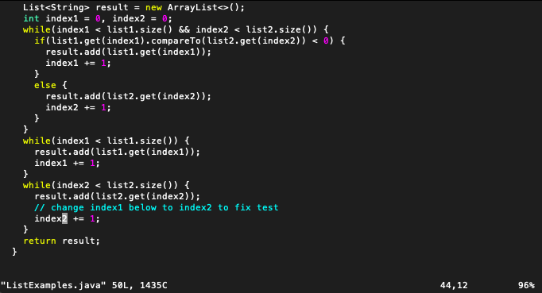
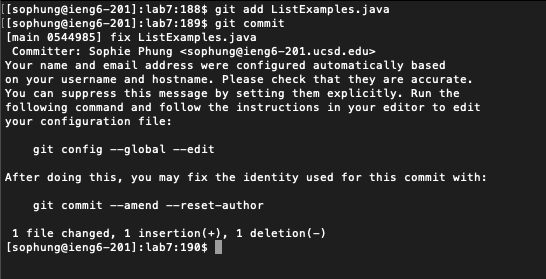

# Lab Report 4

## Log into ieng6

* Keys Pressed: `ssh sophung@ieng6-201.ucsd.edu` `<enter>`
* This allows me to log into the ieng6 server, specifically 201 since 203 was having errors.

## Clone your fork of the repository from your Github account (using the `SSH` URL)

* Keys Pressed: `git clone git@github.com:sophiepng/lab7.git <enter>`
* This allows me to clone the forked lab7 repository from my Github account, with the SSH url. 

## Run the tests, demonstrating that they fail

* Keys Pressed: `cd lab7` `<enter>` `bash test.sh` `<enter>`
* First I changed directories into the cloned lab7 repository, then I ran the tests through the test.sh bash script.

## Edit the code file to fix the failing test

* Keys Pressed: `vim ListExamples.java` `enter`  
  `jjjjjjjjjjjjjjjjjjjjjjjjjjjjjjjjjjjjjjjjjjj` `lllllll` `x` `i` `2` `<esc>`  
  `:wq <enter>`
* To edit the code, I opened ListExamples.java in VIM, then used the `j` and `l` keys to navigate the cursor to the mistake to fix the code. I pressed `x` to delete the `1`, and
  replaced it by pressing `i` to enter insert mode, inserting `2`, and escaping from insert mode. Then I saved and exited the file in VIM through `:wq`.

## Run the tests, demonstrating that they now succeed

* Keys Pressed: `<up> <up> <enter>`
* I used the up arrow to access the previously used `bash test.sh` command and run the tests, where this time they both succeeded. 

## Commit and push the resulting change to your Github account

* Keys Pressed: `git add Lis` `<tab>` `<enter>`  
  `git commit <enter>` `i` `fix ListExamples.java` `<esc>`  
  `:wq <enter>`  
  `git push origin main` `<enter>`
* I added and committed the changes made to ListExamples.java to git, (I used `<tab>` to autocomplete the name of ListExamples.java) and wrote the commit message by entering
  insert mode through `i` and typing the message and escaping, then saving the file through `:wq` and pushing the changes to main.

