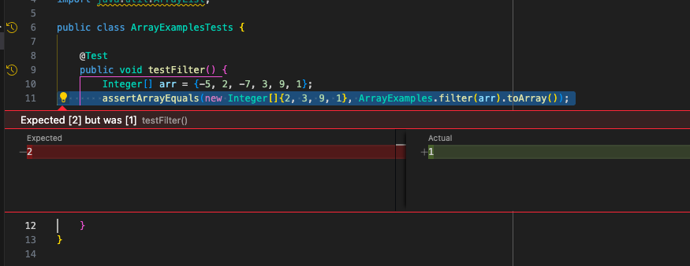
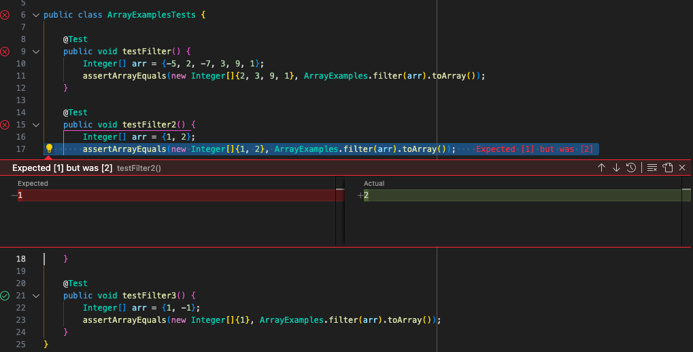

# Lab Report 5

## Part 1 – Debugging Scenario
### 1. Symptom and description of guess at bug <br>
 <br>
My filter method is getting the wrong output, it's 1 instead of 2. Is my method adding the wrong elements or is it out of order? 

### 2. A response from a TA asking a leading question or suggesting a command to try
Could you try testing other arrays to see how your method is out of order? You could test to make sure it is filtering out the negative numbers correctly, and test an array with
less elements to see what order it's being added in.

### 3. What information the student got from trying that, and a clear description of what the bug is
 <br>
The bug is that the method is adding the elements in reverse. In ArrayExamples.java, the for each loop that adds the number to the result list adds to the 0th index of the list
each time instead of the end of the list, causing the returned list to be in reverse order. 

### 4. All the information needed about the setup <br>
**The file & directory structure needed** <br>
```
- home
  - ArrayExamples.java
  - ArrayExamplesTests.java
  - test.sh
  - lib
    - hamcrest-core-1.3.jar
    - junit-4.13.2.jar
```

**The contents of each file *before* fixing the bug** <br>
ArrayExamples.java
```java
import java.util.ArrayList;
import java.util.List;

class ArrayExamples {
  // Returns a new array that has all the elements of the input array greater 
  //than zero, in the same order they appeared in the input array;
  static List<Integer> filter(Integer[] array) {
    List<Integer> result = new ArrayList<>();
    for (Integer num : array) {
      if (num.compareTo(0) > 0) {
        result.add(0, num); 
      }
    }
    return result;
  }
}
```
ArrayExamplesTests.java
```java
import static org.junit.Assert.*;
import org.junit.*;

public class ArrayExamplesTests {

    @Test
    public void testFilter() {
        Integer[] arr = {-5, 2, -7, 3, 9, 1};
        assertArrayEquals(new Integer[]{2, 3, 9, 1}, ArrayExamples.filter(arr).toArray());
    }

    @Test //newly added test
    public void testFilter2() {
        Integer[] arr = {1, 2};
        assertArrayEquals(new Integer[]{1, 2}, ArrayExamples.filter(arr).toArray());
    }

    @Test //newly added test
    public void testFilter3() { 
        Integer[] arr = {1, -1};
        assertArrayEquals(new Integer[]{1}, ArrayExamples.filter(arr).toArray());
    }
}
```
test.sh
```console
javac -cp .:lib/hamcrest-core-1.3.jar:lib/junit-4.13.2.jar *.java
java -cp .:lib/hamcrest-core-1.3.jar:lib/junit-4.13.2.jar org.junit.runner.JUnitCore ArrayExamplesTests
```

**The full command line (or lines) you ran to trigger the bug** <br>
```bash
bash test.sh

JUnit version 4.13.2
.E..E
Time: 0.01
There were 2 failures:
1) testFilter2(ArrayExamplesTests)
arrays first differed at element [0]; expected:<1> but was:<2>
        at org.junit.internal.ComparisonCriteria.arrayEquals(ComparisonCriteria.java:78)
        at org.junit.internal.ComparisonCriteria.arrayEquals(ComparisonCriteria.java:28)
        at org.junit.Assert.internalArrayEquals(Assert.java:534)
        at org.junit.Assert.assertArrayEquals(Assert.java:285)
        at org.junit.Assert.assertArrayEquals(Assert.java:300)
        at ArrayExamplesTests.testFilter2(ArrayExamplesTests.java:17)
        ... 32 trimmed
Caused by: java.lang.AssertionError: expected:<1> but was:<2>
        at org.junit.Assert.fail(Assert.java:89)
        at org.junit.Assert.failNotEquals(Assert.java:835)
        at org.junit.Assert.assertEquals(Assert.java:120)
        at org.junit.Assert.assertEquals(Assert.java:146)
        at org.junit.internal.ExactComparisonCriteria.assertElementsEqual(ExactComparisonCriteria.java:8)
        at org.junit.internal.ComparisonCriteria.arrayEquals(ComparisonCriteria.java:76)
        ... 38 more
2) testFilter(ArrayExamplesTests)
arrays first differed at element [0]; expected:<2> but was:<1>
        at org.junit.internal.ComparisonCriteria.arrayEquals(ComparisonCriteria.java:78)
        at org.junit.internal.ComparisonCriteria.arrayEquals(ComparisonCriteria.java:28)
        at org.junit.Assert.internalArrayEquals(Assert.java:534)
        at org.junit.Assert.assertArrayEquals(Assert.java:285)
        at org.junit.Assert.assertArrayEquals(Assert.java:300)
        at ArrayExamplesTests.testFilter(ArrayExamplesTests.java:11)
        ... 32 trimmed
Caused by: java.lang.AssertionError: expected:<2> but was:<1>
        at org.junit.Assert.fail(Assert.java:89)
        at org.junit.Assert.failNotEquals(Assert.java:835)
        at org.junit.Assert.assertEquals(Assert.java:120)
        at org.junit.Assert.assertEquals(Assert.java:146)
        at org.junit.internal.ExactComparisonCriteria.assertElementsEqual(ExactComparisonCriteria.java:8)
        at org.junit.internal.ComparisonCriteria.arrayEquals(ComparisonCriteria.java:76)
        ... 38 more

FAILURES!!!
Tests run: 3,  Failures: 2

```

**A description of what to edit to fix the bug** <br>
To fix the bug, you have to make sure the for each loop is not adding to the beginning of the list each time, so I used the add method of the list without an index argument to 
append the specified element to the end of the list.
```java
class ArrayExamples {
  static List<Integer> filter(Integer[] array) {
    List<Integer> result = new ArrayList<>();
    for (Integer num : array) {
      if (num.compareTo(0) > 0) {
        result.add(num); //Changed to add(E e) method with no index arg
      }
    }
    return result;
  }
```
When running the bash script in the terminal all the tests now pass.
```bash
bash test.sh
JUnit version 4.13.2
...
Time: 0.012

OK (3 tests)

```


## Part 2 – Reflection
Something I learned from lab in the second half of the quarter that I didn't know before is using debuggers. I didn't know how to use it before but it's super cool to be able to 
pause the code and see the varibles to understand and debug easier. I ended up using it in a different class to debug a method that was stuck in an infinite loop, so it was very 
useful.
 
